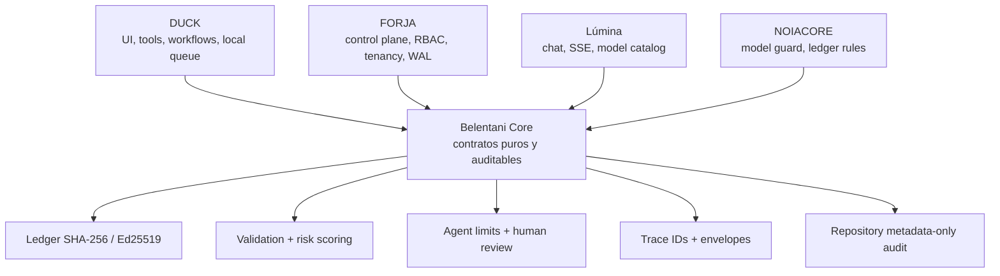

# Arquitectura Belentani Core

## Principio

Belentani Core se construye como una capa de contratos pequeños, puros y verificables. No reemplaza a DUCK, FORJA, Lúmina ni NOIACORE; evita que cada producto vuelva a implementar controles equivalentes.

## Reutilización comprobada

FORJA consume directamente `packages/belentani-core/src/ledger.ts` para `canonicalAuditPayload`, `computeAuditHash` y `verifyAuditSignature`; los tests criptográficos existentes siguen pasando. El resto de contratos tiene tests en `server/belentani-core.test.ts`, pero no se introduce una dependencia ficticia en las rutas de producto hasta que cada consumidor tenga un contrato de integración claro.

| Capa | Debe vivir en Core | Debe permanecer en el producto |
|---|---|---|
| Identidad | Trace ID, envelopes, límites genéricos | OAuth, cookies, organización y membresías |
| Seguridad | Validación, scrubber, hash y firma | RBAC específico, policies, trusted keys y tenancy |
| AI | Límites de entrada y revisión humana | Proveedor, modelo, prompt de producto y streaming |
| Repositorios | Normalización y auditoría metadata-only | Credenciales Git, clonación, almacenamiento y aprobación |
| Automatización | Contratos de retry/readiness | Heartbeat, jobs, colas y persistencia |

## Lo que no se fusiona todavía

El verificador Rust/Wasm del blueprint FORJA y la sincronización Yjs/MLS permanecen experimentales: el código contiene dependencias o llamadas hipotéticas y no ha demostrado un build integrado en esta sesión. El worker de DUCK permanece específico del runtime local; su extracción exigiría una cola durable y garantías de aislamiento diferentes. Estas piezas se registran como módulos futuros, no como capacidades actuales de Core.
